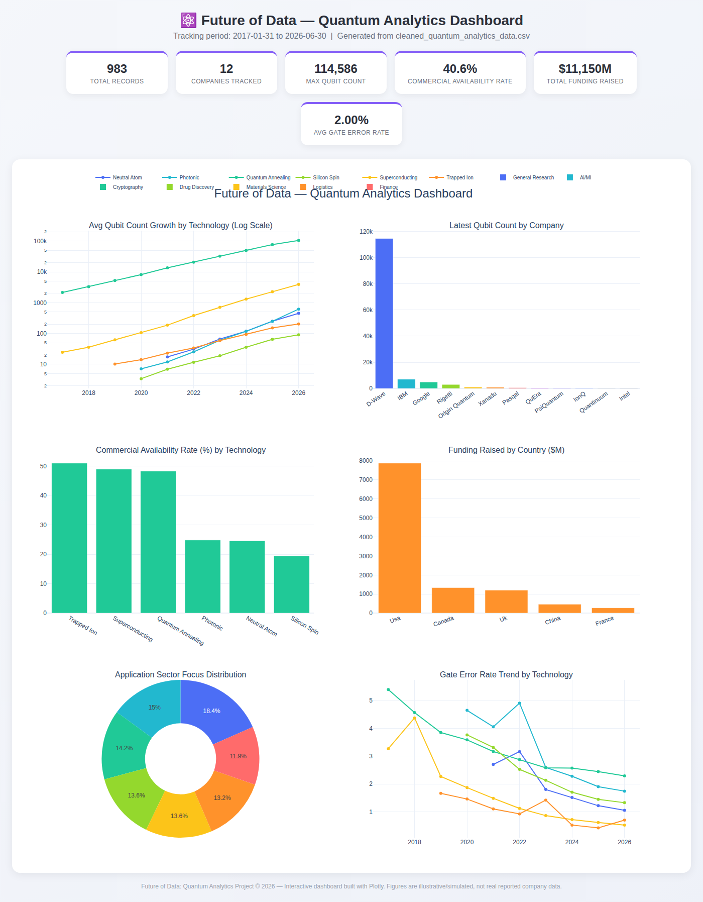
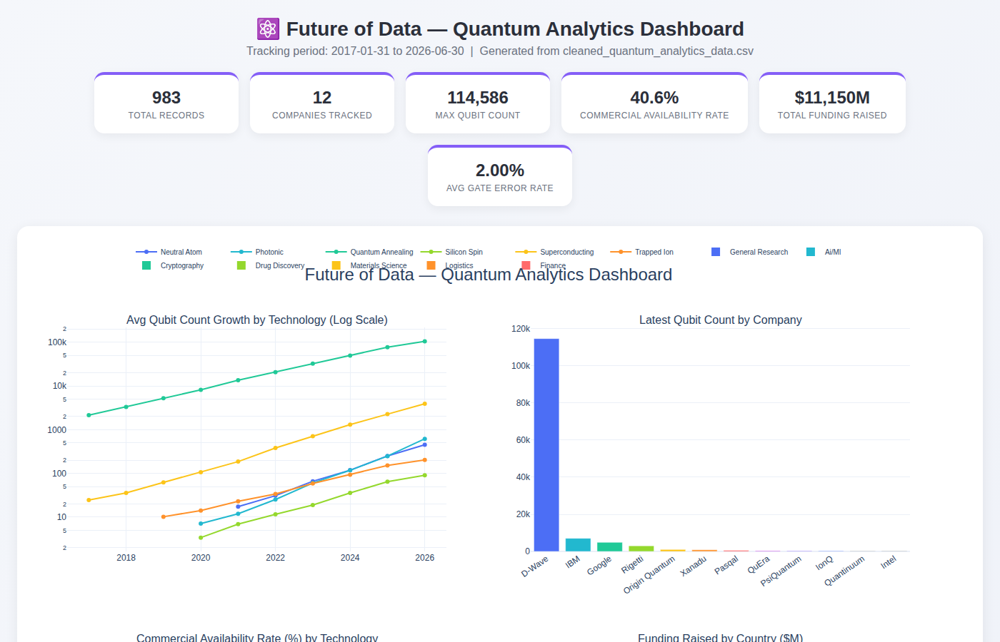
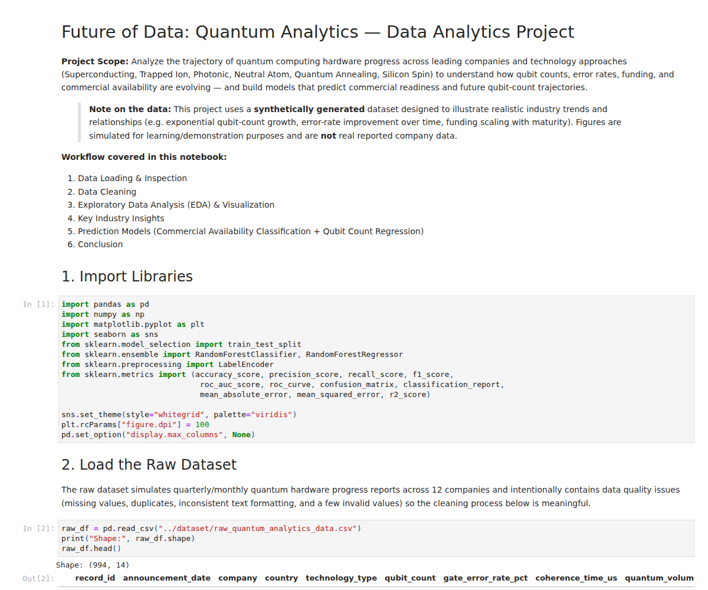

# ⚛️ Future of Data: Quantum Analytics — Data Analytics Project

An end-to-end data analytics project analyzing the trajectory of quantum
computing hardware progress across leading companies and technology
approaches — covering data cleaning, exploratory analysis, visualization,
machine learning prediction models, and an interactive dashboard.

> ⚠️ **Before submitting:** replace the placeholders in the table below with
> your actual details.

| Field | Details |
|---|---|
| **Intern ID** | `[Your Intern ID]` |
| **Full Name** | `[Your Full Name]` |
| **No. of Weeks** | `[Number of Weeks]` |
| **Project Name** | Future of Data: Quantum Analytics |
| **Project Scope** | Analyze quantum computing hardware progress data to uncover growth trends across technology approaches and companies, clean and prepare the dataset, visualize qubit-count and error-rate trends, build prediction models for commercial-availability classification and qubit-count forecasting, and present findings via an interactive dashboard. |

> **Note on the data:** This project uses a **fully synthetic dataset**
> designed to illustrate realistic quantum-computing industry trends
> (exponential qubit scaling, error-rate improvement, funding growth). The
> figures are simulated for demonstration purposes and are **not** real
> reported numbers from IBM, Google, IonQ, or any other named company.

---

## 🎯 Project Overview

Quantum computing is often called the "next frontier" of data and
computation. This project analyzes nearly a decade (2017–2026) of
(synthetic) quantum hardware milestone data across 12 companies and 6
technology approaches to answer:

- How fast are qubit counts and quantum volume actually growing?
- Which technology approach has the best error rates / fidelity?
- What predicts whether a system reaches commercial availability?
- Can we forecast future qubit-count trajectories?

## 🗂️ Repository Structure

```
Future-of-Data-Quantum-Analytics/
├── README.md                                   # This file
├── dataset/
│   ├── raw_quantum_analytics_data.csv          # Raw (uncleaned) synthetic dataset
│   └── cleaned_quantum_analytics_data.csv      # Cleaned, analysis-ready dataset
├── notebook/
│   └── Quantum_Analytics_Analysis.ipynb        # Full executed analysis notebook
├── src/                                         # Standalone, commented Python scripts
│   ├── 00_generate_raw_dataset.py              # Generates the synthetic raw dataset
│   ├── 01_data_cleaning.py                     # Cleans & prepares the data
│   ├── 02_eda_visualization.py                 # Generates all EDA charts
│   ├── 03_prediction_model.py                  # Trains classification + regression models
│   ├── 04_build_dashboard.py                   # Builds the interactive HTML dashboard
│   └── build_notebook.py                       # Programmatically builds/executes the .ipynb
├── visuals/                                     # 13 exported charts (.png)
├── dashboard/
│   └── quantum_analytics_dashboard.html        # Interactive Plotly dashboard (open in browser)
├── screenshots/                                 # Screenshots of dashboard & notebook output
├── output/                                      # Text reports (cleaning log, model metrics)
└── documentation/
    └── Project_Documentation.md                 # Full write-up: methodology & findings
```

## 🧹 1. Data Cleaning

The raw dataset was deliberately generated with realistic issues — missing
values, duplicate rows, inconsistent text casing, and a few invalid values
(negative qubit counts, error rate > 100%) — then cleaned in
`src/01_data_cleaning.py`:

- Standardized text formatting across all categorical columns
- Restored correct brand-name capitalization (title-casing mangles "IBM" → "Ibm", "IonQ" → "Ionq")
- Parsed and validated the announcement date
- Removed duplicate rows
- Fixed invalid/out-of-range values
- Imputed missing values using **per-technology-type medians**
- Added derived columns (`year`, `quarter`, `qubits_per_error`)

📄 Full cleaning log: [`output/data_cleaning_report.txt`](output/data_cleaning_report.txt)

## 📈 2. Visualization & Analysis

| Chart | Insight |
|---|---|
| Qubit Growth by Technology (log scale) | Exponential scaling across all approaches |
| Latest Qubit Count by Company | D-Wave leads on raw qubits (annealing ≠ gate-model) |
| Gate Error Rate Trend | Trapped Ion shows the lowest error rates |
| Funding by Country | USA leads cumulative funding by a wide margin |
| Commercial Availability by Technology | Trapped Ion & Superconducting most commercially mature |
| Correlation Heatmap | Funding & maturity correlate with commercial availability |
| Sector Focus Distribution | Research applications spread across 7 target sectors |
| Quantum Volume Trend | Composite scale+fidelity metric climbing across all technologies |

All charts: [`visuals/`](visuals/)

## 🤖 3. Prediction Models

| Model | Type | Purpose | Key Metric |
|---|---|---|---|
| Random Forest Classifier | Classification | Predict commercial availability | **ROC-AUC: 0.725**, F1: 0.594 |
| Random Forest Regressor | Regression | Predict qubit count trajectory | **R²: 0.988**, MAE: 304.8 qubits |

📄 Full metrics report: [`output/model_performance_report.txt`](output/model_performance_report.txt)

## 📊 4. Interactive Dashboard

`dashboard/quantum_analytics_dashboard.html` is a **self-contained** file
(Plotly.js embedded) — just download and open it in any browser, no server
required. It includes 6 KPI cards and 6 interactive charts (qubit growth by
technology, latest qubit count by company, commercial availability rate,
funding by country, sector focus distribution, and error rate trends).

**Preview:**



## 🖼️ Screenshots

| Dashboard | Notebook Output |
|---|---|
|  |  |

## 🛠️ How to Run This Project

```bash
# 1. Clone the repository
git clone <your-repo-url>
cd Future-of-Data-Quantum-Analytics

# 2. Install dependencies
pip install pandas numpy matplotlib seaborn scikit-learn plotly jupyter

# 3. Run the pipeline (in order)
python src/00_generate_raw_dataset.py   # generates dataset/raw_quantum_analytics_data.csv
python src/01_data_cleaning.py          # generates dataset/cleaned_quantum_analytics_data.csv
python src/02_eda_visualization.py      # generates visuals/*.png
python src/03_prediction_model.py       # trains models, generates model reports & plots
python src/04_build_dashboard.py        # generates dashboard/quantum_analytics_dashboard.html

# 4. Or explore everything interactively:
jupyter notebook notebook/Quantum_Analytics_Analysis.ipynb

# 5. Open the dashboard
# Simply double-click dashboard/quantum_analytics_dashboard.html or open it in a browser
```

## 🧰 Tools & Technologies

- **Python** — Pandas, NumPy
- **Visualization** — Matplotlib, Seaborn, Plotly
- **Machine Learning** — Scikit-learn (Random Forest Classifier & Regressor, ROC-AUC)
- **Notebook** — Jupyter
- **Dashboard** — Plotly (self-contained interactive HTML)

## 📄 Deliverables Checklist

- [x] Source Code (`src/`, `notebook/`)
- [x] README File (this file)
- [x] Screenshots (`screenshots/`)
- [x] Output Images / Graphs & Charts (`visuals/`)
- [x] Documentation (`documentation/Project_Documentation.md`)
- [x] Dataset Files (`dataset/`)
- [x] Dashboard (`dashboard/quantum_analytics_dashboard.html`)

## 📚 Full Documentation

See [`documentation/Project_Documentation.md`](documentation/Project_Documentation.md)
for the complete methodology write-up, dataset schema, key findings, and
recommendations.

---

*This project uses a synthetically generated dataset designed to illustrate
realistic quantum-computing industry trends, built for demonstration/learning
purposes. Figures are simulated, not real reported company data.*
